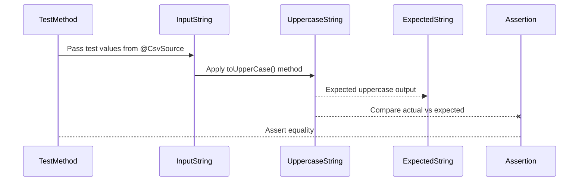

# Rabobank Engineers Week - Parameterized Testing


## Overview
[JUnit 5](https://junit.org/junit4/), the latest iteration of the popular testing framework, introduces a host of new features designed to enhance the developer testing experience. Among these features is the powerful concept of parameterized tests. Parameterized tests allow developers to run a single test method multiple times with different sets of parameters, making it easier to test various scenarios and edge cases efficiently.

In this comprehensive tutorial, we will delve into the intricacies of parameterized tests in JUnit 5. We'll cover everything from basic usage to advanced techniques, ensuring you have a thorough understanding of how to leverage this feature to improve your testing strategy.

Let's get started!

## Dependencies

### Utilizing JUnit 5 Parameterized Tests

To utilize JUnit 5 parameterized tests, you need to include the `junit-jupiter-params` artifact from the JUnit Platform in your project dependencies. Here's how you can do it for both Maven and Gradle:

#### Maven

Add the following dependency to your `pom.xml` file:

```xml  
<!-- https://mvnrepository.com/artifact/org.junit.jupiter/junit-jupiter-params -->  
<dependency>  
 <groupId>org.junit.jupiter</groupId>
 <artifactId>junit-jupiter-params</artifactId>
 <version>5.12.1</version>
 <scope>test</scope>
</dependency>  
```  

#### Gradle

Include the dependency in your `build.gradle` file:

```groovy  
dependencies {  
 testImplementation("org.junit.jupiter:junit-jupiter-params:5.12.1")}  
```  

By adding these dependencies, you enable the use of parameterized tests in JUnit 5, allowing you to run a single test method multiple times with different parameters. This is particularly useful for testing various input scenarios and ensuring your code handles all edge cases effectively.

**You can always use `spring-boot-starter-test`. At the time that this was written, we are using  3.4.4.**


```xml  
<!-- https://mvnrepository.com/artifact/org.springframework.boot/spring-boot-starter-test -->
<dependency>
    <groupId>org.springframework.boot</groupId>
    <artifactId>spring-boot-starter-test</artifactId>
    <version>3.4.4</version>
    <scope>test</scope>
</dependency>
```  


## Understanding Parameterized Tests in JUnit 5

When testing a utility function, for example, such as determining whether a number is odd, it is crucial to validate its correctness across a diverse set of input values. Ensuring comprehensive test coverage helps identify edge cases and guarantees the function behaves as expected in all scenarios. A common approach is to write multiple individual test cases using JUnit’s  `@Test`annotation, where each test case evaluates the function’s output for a specific input. By systematically covering both typical and boundary values—such as positive numbers, negative numbers, and zero—we can strengthen the reliability of the function and minimize potential errors in production code.

### The Utility Class

Before diving into testing, let’s define our utility class

```java
/**
 * The CalculatorExample class provides utility methods for number operations.
 */
public class CalculatorExample {  

    /**
     * Checks if a given number is odd.
     *
     * @param number the number to check
     * @return true if the number is odd, false otherwise
     */
    public static boolean isOdd(int number) {
        return number % 2 != 0; 
    }
    
    //...
}

```

### Traditional Testing Approach
JUnit is one of the most widely used frameworks for unit testing in Java applications. It allows developers to write tests that verify the functionality of individual components within their software. The traditional approach involves writing separate assertions within a single test method, ensuring that various test scenarios are covered systematically.

#### 1. Structure of a Traditional JUnit Test

A JUnit test typically consists of:

-   **Setup**: Preparing the necessary objects or state before running the tests.

-   **Execution**: Performing actions that trigger the behavior to be tested.

-   **Assertions**: Comparing expected results with actual outcomes.


Here’s an example demonstrating the traditional approach:

```java
import static org.junit.jupiter.api.Assertions.assertEquals;

import nl.rabobank.ew.parameterizedtest.examples.CalculatorExample;
import org.junit.jupiter.api.Test;

/**
 * Unit test class for {@link CalculatorExample}.  
 * This class tests the addition functionality of {@code CalculatorExample}.  
 */
class CalculatorTest {

    /**
     * Tests the {@link CalculatorExample#add(int, int)} method.  
     * Verifies that addition operations return the expected results. */
    @Test
    void testAddition() {
        CalculatorExample calculator = new CalculatorExample();

        // Multiple assertions within a single test method  
        assertEquals(5, calculator.add(2, 3), "2 + 3 should equal 5");
        assertEquals(0, calculator.add(-1, 1), "-1 + 1 should equal 0");
        assertEquals(-3, calculator.add(-1, -2), "-1 + (-2) should equal -3");
    }
}
```

#### 2. Advantages of the Traditional Approach

-   **Concise**: All assertions related to a function can be grouped in one method.

-   **Efficient**: Reduces the number of test methods, making tests appear more compact.


#### 3. Disadvantages of the Traditional Approach

-   **Difficult Debugging**: If multiple assertions fail, JUnit may only report the first failure, making debugging harder.

-   **Reduced Granularity**: Each test covers multiple cases, making it harder to identify exactly where an issue is occurring.


#### 4. Alternative Approach: Writing Separate Test Methods

To improve test granularity, developers often write individual test methods for each scenario:

```java
/**  
 * Tests the addition of two positive numbers. * Verifies that positive numbers are summed correctly. */
@Test  
void testAdditionPositiveNumbers() {  
    CalculatorExample calculator = new CalculatorExample();  
    assertEquals(5, calculator.add(2, 3), "2 + 3 should equal 5");  
}  
  
/**  
 * Tests the addition of two negative numbers. * Verifies that negative numbers are summed correctly. */
@Test  
void testAdditionNegativeNumbers() {  
    CalculatorExample calculator = new CalculatorExample();  
    assertEquals(-3, calculator.add(-1, -2), "-1 + (-2) should equal -3");  
}  
  
/**  
 * Tests the addition of a negative and a positive number. * Verifies that neutralization through addition works as expected. */
@Test  
void testAdditionNeutralNumbers() {  
    CalculatorExample calculator = new CalculatorExample();  
    assertEquals(0, calculator.add(-1, 1), "-1 + 1 should equal 0");  
}
```


This approach enhances test clarity and debugging while maintaining systematic coverage.

### Introducing Parameterized Tests

JUnit 5 provides  **parameterized tests**, which allow us to run the same test logic multiple times with different input values, reducing redundancy.

To implement a parameterized test, we replace  `@Test`  with  `@ParameterizedTest`  and provide a source of test values via the  `@ValueSource`  annotation:

```java
@ParameterizedTest  
@ValueSource(ints = {1, 3, 5, -3, 15, Integer.MAX_VALUE}) // List of test cases  
void isOdd_ShouldReturnTrueForOddNumbers(int number) {  
    assertTrue(calculator.isOdd(number));  
}
```

### How This Works

1.  **Source of Arguments**: The  `@ValueSource`  annotation provides a predefined list of integers that will be passed into the test method.

2.  **Execution Mechanism**: The JUnit 5 test runner executes the test  **once per value**, automatically assigning each integer from the  `@ValueSource`  array to the  `number`  parameter.

3.  **Resulting Behavior**: Each execution calls the  `isOdd`  method with a different input and asserts its correctness.


Image Taken from [Waldo.com](https://www.waldo.com/blog/parameterized-test-junit)

Instead of manually writing multiple assertions, the parameterized test ensures the method is verified against various values dynamically, making the test cleaner, more scalable, and easier to extend.

### Expanding Parameterized Testing

The example above focuses on a simple integer array, but JUnit 5 supports various  **sources of input**, including:

-   `@CsvSource`  for providing multiple parameters in a CSV format.

-   `@EnumSource`  for testing with enum values.

-   `@MethodSource`  for supplying arguments via custom methods.

-   `@ArgumentsSource`  for advanced argument handling.


By using parameterized tests, developers can streamline their test code while ensuring robustness and maintainability.


## 1. Argument Sources

As we should know by now, a parameterized test executes the same test multiple times with different arguments.

And we can hopefully do more than just numbers, so let’s explore.

### 1.1. Simple Values

With the `@ValueSource` annotation, we can pass an array of literal values to the test method.

Suppose we’re going to test our simple `isBlank` method:

```java  
/**
 * Utility class for string-related operations.
 */
public class StringsExample {  

    /**
     * Checks if a given string is blank.
     * A string is considered blank if it is null, empty, or contains only whitespace.
     *
     * @param input the string to check
     * @return {@code true} if the input is blank, {@code false} otherwise
     */
    public static boolean isBlank(String input) {
        return input == null || input.trim().isEmpty(); 
    }
}
```  

We expect this method to return `true` for `null` or blank strings. So, we can write a parameterized test to assert this behavior:

```java  
import static org.junit.jupiter.api.Assertions.assertTrue;
import org.junit.jupiter.params.ParameterizedTest;
import org.junit.jupiter.params.provider.ValueSource;

/**
 * Unit test for {@link StringsExample#isBlank(String)} method.
 * Tests cases where the input should be considered blank.
 */
class StringsTest {

    /**
     * Tests the {@code isBlank} method to ensure it correctly identifies blank strings.
     * <p>
     * This test uses a parameterized approach with {@link ValueSource} to pass different blank 
     * strings, including an empty string and a string with only whitespace.
     * </p>
     *
     * @param input the input string to be checked for blankness
     */
    @ParameterizedTest
    @ValueSource(strings = {"", "  "})
    void isBlank_ShouldReturnTrueForNullOrBlankStrings(String input) {
        assertTrue(StringsExample.isBlank(input), "Expected input to be considered blank");
    }
}
```  

As we can see, JUnit will run this test two times and each time assigns one argument from the array to the method parameter.

One of the limitations of value sources is that they only support these types:

- `short` (with the `shorts` attribute)
- `byte` (`bytes` attribute)
- `int` (`ints` attribute)
- `long` (`longs` attribute)
- `float` (`floats` attribute)
- `double` (`doubles` attribute)
- `char` (`chars` attribute)
- `java.lang.String` (`strings` attribute)
- `java.lang.Class` (`classes` attribute)

Also, we can only pass one argument to the test method each time.

Before going any further, note that we didn’t pass `null` as an argument. That’s another limitation — we can’t pass `null` through a `@ValueSource`, even for `String` and `Class`.

### 1.2. Null and Empty Values

As of JUnit 5.4, we can pass a single `null` value to a parameterized test method using `@NullSource`:

```java  
/**
 * Tests {@code StringsExample.isBlank()} with different inputs.
 * <p>
 * This parameterized test verifies that {@code isBlank()} correctly returns {@code true}
 * when provided with {@code null} inputs.
 *
 * @param input the input string to be tested (in this case, {@code null})
 */
@ParameterizedTest
@NullSource
void isBlank_ShouldReturnTrueForNullInputs(String input) {
    assertTrue(StringsExample.isBlank(input));
}
```  

Since primitive data types can’t accept `null` values, we can’t use the `@NullSource` for [primitive arguments](https://docs.oracle.com/javase/tutorial/java/nutsandbolts/datatypes.html).

Quite similarly, we can pass empty values using the `@EmptySource` annotation:

```java  
/**
 * Parameterized test to verify {@code StringsExample.isBlank()} behavior with empty inputs.
 * <p>
 * This test checks that {@code isBlank()} correctly returns {@code true}
 * when provided with an empty string input.
 * <p>
 * The {@code @EmptySource} annotation supplies an empty string as a test argument,
 * ensuring the method properly handles such cases.
 *
 * @param input the input string to be tested (expected to be empty)
 */
@ParameterizedTest
@EmptySource
void isBlank_ShouldReturnTrueForEmptyStrings(String input) {
    assertTrue(StringsExample.isBlank(input));
}
```  

`@EmptySource` passes a single empty argument to the annotated method.

For `String` arguments, the passed value would be as simple as an empty `String`. Moreover, this parameter source can provide empty values for `Collection` types and arrays.

To pass both `null` and empty values, we can use the composed `@NullAndEmptySource` annotation:

```java  
/**
 * Parameterized test to verify {@code StringsExample.isBlank()} behavior with null and empty inputs.
 * <p>
 * This test checks that {@code isBlank()} correctly returns {@code true}
 * when provided with either a {@code null} input or an empty string.
 * <p>
 * The {@code @NullAndEmptySource} annotation supplies both {@code null} and an empty string 
 * as test arguments, ensuring the method handles these cases correctly.
 *
 * @param input the input string to be tested (expected to be {@code null} or empty)
 */
@ParameterizedTest
@NullAndEmptySource
void isBlank_ShouldReturnTrueForNullAndEmptyStrings(String input) {
    assertTrue(StringsExample.isBlank(input));
}
```  

As with the `@EmptySource`, the composed annotation works for `Strings`, `Collections`, and arrays.

To pass a few more empty string variations to the parameterized test, we can combine `@ValueSource`, `@NullSource`, and `@EmptySource`:

```java  
/**
 * Tests the {@code isBlank} method from {@code StringsExample}
 * using various types of blank strings.
 *
 * @param input the string to be tested for blankness
 */
@ParameterizedTest
@NullAndEmptySource
@ValueSource(strings = {"  ", "\t", "\n"})
void isBlank_ShouldReturnTrueForAllTypesOfBlankStrings(String input) {
    assertTrue(StringsExample.isBlank(input));
}

```  

### 1.3. Enum

To run a test with different values from an enumeration, we can use the `@EnumSource` annotation.

For example, we can assert that all month numbers are between 1 and 12:

```java  
/**
 * Parameterized test to verify {@code Month.getValue()} returns valid month numbers.
 * <p>
 * This test ensures that the {@code getValue()} method of the {@code Month} enum
 * always returns values between 1 (January) and 12 (December), inclusive.
 * <p>
 * The {@code @EnumSource(Month.class)} annotation supplies all 12 months as test arguments,
 * verifying correctness across the entire {@code Month} enum.
 *
 * @param month the month to be tested (expected to return values between 1 and 12)
 */
@ParameterizedTest
@EnumSource(Month.class) // passing all 12 months
void getValueForAMonth_IsAlwaysBetweenOneAndTwelve(Month month) {
    int monthNumber = month.getValue();
    assertTrue(monthNumber >= 1 && monthNumber <= 12);
}
```  

Or, we can filter out a few months by using the `names` attribute.

We could also assert the fact that April, September, June, and November are 30 days long:

```java  
/**
 * Parameterized test to verify that certain months have 30 days.
 * <p>
 * This test checks that {@code Month.length(false)} correctly returns {@code 30}
 * for the months April, June, September, and November.
 * <p>
 * The {@code @EnumSource} annotation supplies only these four months as test arguments,
 * ensuring the method handles them appropriately.
 *
 * @param month the month to be tested (expected to have 30 days)
 */
@ParameterizedTest
@EnumSource(value = Month.class, names = {"APRIL", "JUNE", "SEPTEMBER", "NOVEMBER"})
void someMonths_Are30DaysLong(Month month) {
    final boolean isALeapYear = false;
    assertEquals(30, month.length(isALeapYear));
}
```  

By default, the `names` will only keep the matched enum values.

We can turn this around by setting the `mode` attribute to `EXCLUDE`:

```java  
/**
 * Parameterized test to verify that months other than April, June, September, 
 * November, and February have 31 days.
 * <p>
 * This test checks that {@code Month.length(false)} correctly returns {@code 31}
 * for all months except the specified four.
 * <p>
 * The {@code @EnumSource} annotation supplies all months except April, June, 
 * September, November, and February as test arguments, ensuring the method handles them appropriately.
 *
 * @param month the month to be tested (expected to have 31 days)
 */
@ParameterizedTest
@EnumSource(
    value = Month.class, 
    names = {"APRIL", "JUNE", "SEPTEMBER", "NOVEMBER", "FEBRUARY"}, 
    mode = EnumSource.Mode.EXCLUDE)
void exceptFourMonths_OthersAre31DaysLong(Month month) {
    final boolean isALeapYear = false;
    assertEquals(31, month.length(isALeapYear));
}  
```  

In addition to literal strings, we can pass a regular expression to the `names` attribute:

```java  
/**
 * Parameterized test to verify months that end with "ber."
 * <p>
 * This test checks that the {@code Month} enum correctly matches months whose names 
 * end with "ber": September, October, November, and December.
 * <p>
 * The {@code @EnumSource} annotation uses a regex pattern to match any {@code Month}
 * whose name ends in "BER," ensuring the test applies only to the intended months.
 *
 * @param month the month to be tested (expected to be September, October, November, or December)
 */
@ParameterizedTest
@EnumSource(value = Month.class, names = ".+BER", mode = EnumSource.Mode.MATCH_ANY)
void fourMonths_AreEndingWithBer(Month month) {
    EnumSet<Month> months = EnumSet.of(Month.SEPTEMBER, Month.OCTOBER, Month.NOVEMBER, Month.DECEMBER);
    assertTrue(months.contains(month));
}
```  

Quite similar to `@ValueSource`, `@EnumSource` is only applicable when we’re going to pass just one argument per test execution.

### 1.4. CSV Literals

Suppose we’re going to make sure that the `toUpperCase()` method from `String` generates the expected uppercase value. `@ValueSource` won’t be enough.

To write a parameterized test for such scenarios, we have to:

1. Pass an input value and an expected value to the test method
2. Compute the actual result with those input values
3. Assert the actual value with the expected value

So, we need argument sources capable of passing multiple arguments.



This lays out the flow of the test in a structured way, showing how input values move through the process toward validation.

The `@CsvSource` is one of those sources:

```java  
/**
 * Parameterized test to verify the behavior of {@code String.toUpperCase()}.
 * <p>
 * This test checks that converting a string to uppercase produces the expected result.
 * <p>
 * The {@code @CsvSource} annotation supplies various input-output pairs,
 * ensuring the method handles different capitalizations correctly.
 *
 * @param input    the original string to be converted
 * @param expected the expected uppercase output
 */
@ParameterizedTest
@CsvSource({"test,TEST", "tEst,TEST", "Java,JAVA"})
void toUpperCase_ShouldGenerateTheExpectedUppercaseValue(String input, String expected) {
    String actualValue = input.toUpperCase();
    assertEquals(expected, actualValue);
}
```  

The `@CsvSource` accepts an array of comma-separated values, and each array entry corresponds to a line in a CSV file.

This source takes one array entry each time, splits it by a comma, and passes each array to the annotated test method as separate parameters.

By default, the comma is the column separator, but we can customize it using the `delimiter` attribute:

```java  
import org.junit.jupiter.params.ParameterizedTest;
import org.junit.jupiter.params.provider.CsvSource;
import static org.junit.jupiter.api.Assertions.assertEquals;

/**
 * This test verifies that the {@code toLowerCase()} method correctly converts
 * various input strings to their expected lowercase representations.
 */
@ParameterizedTest  
@CsvSource(value = {"test:test", "tEst:test", "Java:java"}, delimiter = ':')  
void toLowerCase_ShouldGenerateTheExpectedLowercaseValue(String input, String expected) {  
    // Convert the input string to lowercase
    String actualValue = input.toLowerCase();  

    // Assert that the actual value matches the expected lowercase representation
    assertEquals(expected, actualValue);  
}
```  

Now it’s a colon-separated value, so still a CSV.

### 1.5. CSV Files

Instead of passing the CSV values inside the code, we can refer to an actual CSV file.

For example, we could use a CSV file like this:

```  
input,expected  
test,TEST  
tEst,TEST  
Java,JAVA  
```  

We can load the CSV file and ignore the header column with `@CsvFileSource`:

```java  
import org.junit.jupiter.params.ParameterizedTest;
import org.junit.jupiter.params.provider.CsvFileSource;
import static org.junit.jupiter.api.Assertions.assertEquals;

/**
 * This test verifies that the {@code toUpperCase()} method correctly converts
 * various input strings to their expected uppercase representations.
 * The test reads input values from an external CSV file.
 */
@ParameterizedTest  
@CsvFileSource(resources = "/data.csv", numLinesToSkip = 1)  
void toUpperCase_ShouldGenerateTheExpectedUppercaseValueCSVFile(String input, String expected) {  
    // Convert the input string to uppercase
    String actualValue = input.toUpperCase();  

    // Assert that the actual value matches the expected uppercase representation
    assertEquals(expected, actualValue);  
}
```  

The `resources` attribute represents the CSV file resources on the classpath to read. And, we can pass multiple files to it.

The `numLinesToSkip` attribute represents the number of lines to skip when reading the CSV files. By default, `@CsvFileSource` does not skip any lines, but this feature is usually useful for skipping the header lines as we did here.

Just like the simple `@CsvSource`, the delimiter is customizable with the `delimiter` attribute.

In addition to the column separator, we have these capabilities:

- The line separator can be customized using the `lineSeparator` attribute — a newline is the default value.
- The file encoding is customizable using the `encoding` attribute — UTF-8 is the default value.

### 1.6. Method

The argument sources we’ve covered so far are somewhat simple and share one limitation. It’s hard or impossible to pass complex objects using them.

One approach to providing more complex arguments is to use a method as an argument source.

Let’s test the `isBlank` method with a `@MethodSource`:

Sure, let's continue from where we left off:

```java  
import org.junit.jupiter.params.ParameterizedTest;
import org.junit.jupiter.params.provider.MethodSource;
import static org.junit.jupiter.api.Assertions.assertEquals;

/**
 * This test verifies that the {@code isBlank()} method correctly identifies
 * null or blank strings. The test uses a method source to provide test cases.
 */
@ParameterizedTest  
@MethodSource("provideStringsForIsBlank")  
void isBlank_ShouldReturnTrueForNullOrBlankStrings(String input, boolean expected) {  
    // Assert that the isBlank method correctly identifies blank or null strings
    assertEquals(expected, StringsExample.isBlank(input));  
}
```  

The name we supply to `@MethodSource` needs to match an existing method.

So, let’s next write `provideStringsForIsBlank`, a static method that returns a `Stream` of `Arguments`:

```java  
import java.util.stream.Stream;
import org.junit.jupiter.params.provider.Arguments;

/**
 * Provides test cases for the {@code isBlank()} method.
 * The method returns a stream of arguments containing various input strings
 * and their expected boolean results.
 *
 * @return a stream of test cases for the {@code isBlank()} method
 */
private static Stream<Arguments> provideStringsForIsBlank() {  
    return Stream.of(
        Arguments.of(null, true),
        Arguments.of("", true),
        Arguments.of("  ", true),
        Arguments.of("not blank", false)
    );
}
```  

Here we’re returning a stream of arguments, but it’s not a strict requirement. For example, we can return any other collection-like interfaces like `List`.

If we’re going to provide just one argument per test invocation, then it’s not necessary to use the `Arguments` abstraction:

```java  
import java.util.stream.Stream;
import org.junit.jupiter.params.ParameterizedTest;
import org.junit.jupiter.params.provider.MethodSource;
import static org.junit.jupiter.api.Assertions.assertTrue;

/**
 * This test verifies that the {@code isBlank()} method correctly identifies
 * null or blank strings using a single argument. The test method automatically
 * matches the method source since their names are identical.
 */
@ParameterizedTest  
@MethodSource // hmm, no method name ...
void isBlank_ShouldReturnTrueForNullOrBlankStringsOneArgument(String input) {  
    // Assert that the isBlank method correctly identifies blank or null strings
    assertTrue(StringsExample.isBlank(input));  
}

/**
 * Provides test cases for the {@code isBlank()} method.
 * Returns a stream of strings containing various input values.
 *
 * @return a stream of blank or null strings
 */
private static Stream<String> isBlank_ShouldReturnTrueForNullOrBlankStringsOneArgument() {  
    return Stream.of(null, "", "  ");
}
```  

When we don’t provide a name for the `@MethodSource`, JUnit will search for a source method with the same name as the test method.

Sometimes, it’s useful to share arguments between different test classes. In these cases, we can refer to a source method outside of the current class by its fully qualified name:

```java  
/**
 * Unit test for the {@code isBlank()} method.
 * This test retrieves test cases from an external source method.
 */
class StringsTest {  
    @ParameterizedTest
    @MethodSource("nl.rabobank.parameterized.StringParams#blankStrings")
    void isBlank_ShouldReturnTrueForNullOrBlankStringsExternalSource(String input) {  
        // Assert that the isBlank method correctly identifies blank or null strings
        assertTrue(StringsExample.isBlank(input));  
    }  
}

/**
 * Provides test cases for the {@code isBlank()} method.
 * This external method supplies a stream of blank or null strings for testing.
 */
public class StringParams {  
    static Stream<String> blankStrings() {  
        return Stream.of(null, "", "  ");  
    }  
}
```  

Using the `FQN#methodName` format, we can refer to an external static method.

### 1.7. Field

Using a method as the argument source proved to be a useful way to supply the test data. Consequently, starting with JUnit 5.11, we can now use a similar feature with static fields, through the experimental annotation `@FieldSource`:

```java  
static List<String> cities = Arrays.asList("Madrid", "Rome", "Paris", "London");  
  
/**
 * Unit test for {@code Strings.isBlank(String)} method.
 * Ensures that the method returns {@code false} when 
 * the argument has at least one character.
 *
 * @param arg a non-null string argument provided by the FieldSource "cities"
 */
@ParameterizedTest  
@FieldSource("cities")  
void isBlank_ShouldReturnFalseWhenTheArgHasAtLeastOneCharacter(String arg) {  
    assertFalse(Strings.isBlank(arg));
}
```  

As we can see, the annotation points to a static field referencing the test data, which can be represented as a `Collection`, an `Iterable`, an object array, or a `Supplier<Stream>`. After that, the parameterized test will be executed for each test input. Similar to `@MethodSource`, if the name of the static field matches the name of the test, the value of the annotation can be omitted:

```java  
static String[] isEmpty_ShouldReturnFalseWhenTheArgHasAtLeastOneCharacter = { "Spain", "Italy", "France", "England" };  
  
/**
 * Unit test for {@code String.isEmpty()} method.
 * Ensures that the method returns {@code false} when
 * the argument has at least one character.
 *
 * @param arg a non-null string argument provided by the FieldSource
 */
@ParameterizedTest  
@FieldSource  
void isEmpty_ShouldReturnFalseWhenTheArgHasAtLeastOneCharacter(String arg) {  
    assertFalse(arg.isEmpty());
}
```  
---
#### Difference Between @FieldSource and @MethodSource in JUnit 5

| Feature         | `@MethodSource` | `@FieldSource` |
|----------------|----------------|----------------|
| **Source Type** | Uses a method to provide test data | Uses a static field to provide test data |
| **Return Type** | The method must return a `Stream`, `List`, or other collection-like structure | The field must be a `Collection`, `Iterable`, an array, or a `Supplier<Stream>` |
| **Complexity** | Can generate dynamic test cases and perform calculations before providing data | Provides predefined static data, making it simpler but less flexible |
| **Usage** | Useful when test cases need to be computed or generated dynamically | Useful when test cases are predefined and do not require computation |
| **Introduced In** | Available in JUnit 5 | Introduced in JUnit 5.11 (experimental) |

`@MethodSource` allows for greater flexibility in generating test cases, while `@FieldSource` offers a more direct and static approach to supplying test data.
  
---

### 1.8. Custom Argument Provider

Another advanced approach to pass test arguments is to use a custom implementation of an interface called `ArgumentsProvider`:

```java  
/**
 * Provides a stream of arguments containing various blank string cases for parameterized tests.
 * This includes:
 * - `null`
 * - An empty string `""`
 * - A string with only spaces `"   "`
 */
class BlankStringsArgumentsProvider implements ArgumentsProvider {  
    @Override 
    public Stream<? extends Arguments> provideArguments(ExtensionContext context) { 
        return Stream.of(
            Arguments.of((String) null),  
            Arguments.of(""),   
            Arguments.of("   ")   
        );  
    }  
}

```  

Then we can annotate our test with the `@ArgumentsSource` annotation to use this custom provider:

```java  
/**
 * Tests that Strings.isBlank() correctly identifies null or blank strings.
 * The test uses a parameterized approach with BlankStringsArgumentsProvider
 * to validate different cases, including:
 * - `null`
 * - An empty string `""`
 * - A string containing only spaces `"   "`
 */
@ParameterizedTest  
@ArgumentsSource(BlankStringsArgumentsProvider.class)  
void isBlank_ShouldReturnTrueForNullOrBlankStringsArgProvider(String input) {  
    assertTrue(Strings.isBlank(input));  
}
```  

Let’s make the custom provider a more pleasant API to use with a custom annotation.

### 1.9. Custom Annotation

Suppose we want to load the test arguments from a static variable:

```java  
/**
 * Provides test cases for Strings.isBlank() validation using VariableSource.
 * Each argument consists of:
 * - A string input (which can be null, empty, contain spaces, or a non-blank string)
 * - The expected boolean output indicating whether the input is considered blank
 */
static Stream<Arguments> arguments = Stream.of(  
    Arguments.of(null, true),  // null strings should be considered blank  
    Arguments.of("", true),  
    Arguments.of("  ", true),  
    Arguments.of("not blank", false)  
);  

@ParameterizedTest  
@VariableSource("arguments")  
void isBlank_ShouldReturnTrueForNullOrBlankStringsVariableSource(  
    String input, boolean expected) {  
    assertEquals(expected, Strings.isBlank(input));  
}
```  

Actually, JUnit 5 does not provide this. However, we can roll our own solution.

First, we can create an annotation:

```java  
@Documented  
@Target(ElementType.METHOD)  
@Retention(RetentionPolicy.RUNTIME)  
@ArgumentsSource(VariableArgumentsProvider.class)  
public @interface VariableSource {  
 /** * The name of the static variable */  String value();  
}  
```  

Then we need to somehow consume the annotation details and provide test arguments. JUnit 5 provides two abstractions to achieve those:

- `AnnotationConsumer` to consume the annotation details
- `ArgumentsProvider` to provide test arguments

So, we next need to make the `VariableArgumentsProvider` class read from the specified static variable and return its value as test arguments:

```java  
/**
 * Provides test arguments dynamically from a specified static field in the test class.
 * Implements ArgumentsProvider and AnnotationConsumer to support VariableSource.
 * <p> 
 * The provider:
 * - Retrieves the field name from the VariableSource annotation.
 * - Accesses the field from the test class.
 * - Extracts and returns a stream of arguments for parameterized tests.
 */
class VariableArgumentsProvider   
  implements ArgumentsProvider, AnnotationConsumer<VariableSource> {  

    private String variableName;  

    @Override 
    public void accept(VariableSource variableSource) { 
        variableName = variableSource.value(); 
    }  

    @Override 
    public Stream<? extends Arguments> provideArguments(ExtensionContext context) { 
        return context.getTestClass()
            .map(this::getField)
            .map(this::getValue)
            .orElseThrow(() -> new IllegalArgumentException("Failed to load test arguments"));  
    }  

    private Field getField(Class<?> clazz) { 
        try { 
            return clazz.getDeclaredField(variableName); 
        } catch (Exception e) { 
            return null; 
        } 
    }  

    @SuppressWarnings("unchecked") 
    private Stream<Arguments> getValue(Field field) { 
        try { 
            Object value = field.get(null);
            return value == null ? Stream.empty() : (Stream<Arguments>) value;  
        } catch (Exception ignored) { 
            return Stream.empty();
        }  
    }  
}
```

### Difference Between Multiple Tests and a Single Parameterized Test

#### Single Parameterized Test

Using a single parameterized test allows you to run the same test logic with different sets of input values. This approach reduces code duplication and makes the test cases more maintainable.

```java  
/**
 * Tests the addition functionality of the calculator using parameterized inputs.
 * The test uses @CsvSource to provide multiple cases, ensuring correctness across:
 * - Positive numbers
 * - Negative numbers
 * - Mixed-sign numbers
 * <p>
 * Each test case consists of:
 * - Two integers to be added (a, b)
 * - The expected sum of the two numbers
 */
@ParameterizedTest  
@CsvSource({  
    "1, 1, 2",  
    "2, 3, 5",  
    "-1, -1, -2",  
    "-1, 1, 0"  
})  
void testAdd(int a, int b, int expected) {  
    assertEquals(expected, calculator.add(a, b));  
}

```

**Advantages:**
- **Less Code Duplication:** The test logic is written once and executed with different inputs.
- **Easier Maintenance:** Adding or modifying test cases is simpler as you only need to update the `CsvSource`.
- **Clearer Test Structure:** All test cases for a particular method are grouped together, making it easier to understand the coverage.

#### Multiple Individual Tests

Writing multiple individual tests involves creating separate test methods for each set of input values. This approach can lead to code duplication and make the tests harder to maintain.

```java  
/**
 * Tests the addition functionality of the calculator.
 */
@Test  
void testAdd1() {  
    // Tests addition of two positive numbers
    assertEquals(2, calculator.add(1, 1));  
}

/**
 * Tests the addition functionality of the calculator.
 */
@Test  
void testAdd2() {  
    // Tests addition of two other positive numbers
    assertEquals(5, calculator.add(2, 3));  
}

/**
 * Tests the addition functionality of the calculator.
 */
@Test  
void testAdd3() {  
    // Tests addition of two negative numbers
    assertEquals(-2, calculator.add(-1, -1));  
}

/**
 * Tests the addition functionality of the calculator.
 */
@Test  
void testAdd4() {  
    // Tests addition of a negative and a positive number
    assertEquals(0, calculator.add(-1, 1));  
}
```  

**Advantages:**
- **Explicit Test Cases:** Each test case is explicitly defined, which can make it easier to understand individual test scenarios.
- **Granular Control:** Allows for more granular control over each test case, including specific setup or teardown logic.

**Disadvantages:**
- **Code Duplication:** The same test logic is repeated for each test case, leading to more code.
- **Harder Maintenance:** Adding or modifying test cases requires changes to multiple methods.
- **Cluttered Test Class:** The test class can become cluttered with many small test methods, making it harder to navigate.